# Project-4
# Documentation for Project-4

MEAN STACK DEPLOYMENT TO UBUNTU IN AWS

implementing a simple Book Register web form using MEAN stack

Step 1 - Run sudo apt update

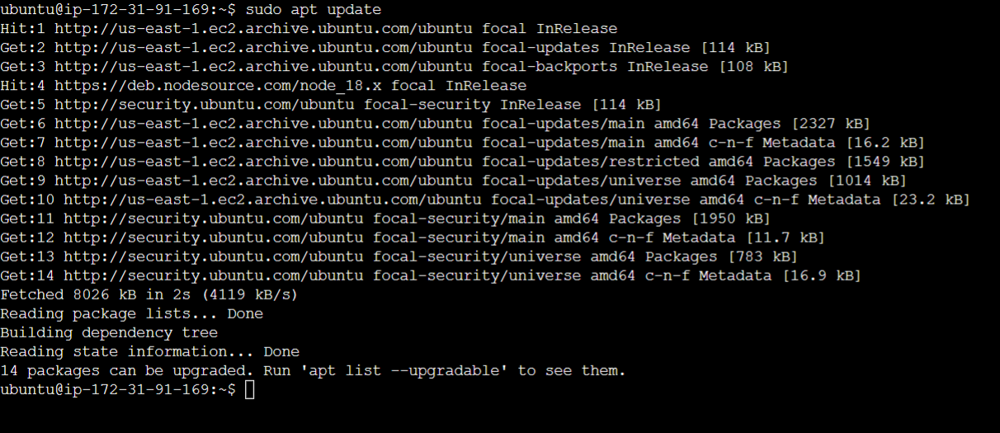

Upgrade ubuntu

sudo apt upgrade

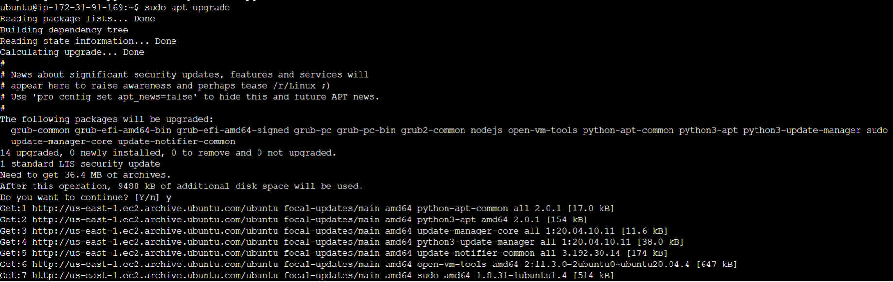

Next, Install NodeJS

sudo apt install -y nodejs

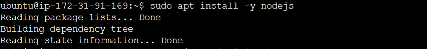

Step 2: Install MongoDB
MongoDB stores data in flexible, JSON-like documents. Fields in a database can vary from document to document and data structure can be changed over time

Install MongoDB

sudo apt install -y mongodb

Start The server

sudo service mongodb start
Verify that the service is up and running

sudo systemctl status mongodb

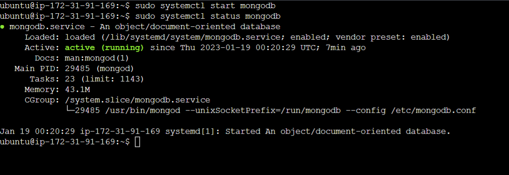

Install npm – Node package manager.

sudo apt install -y npm

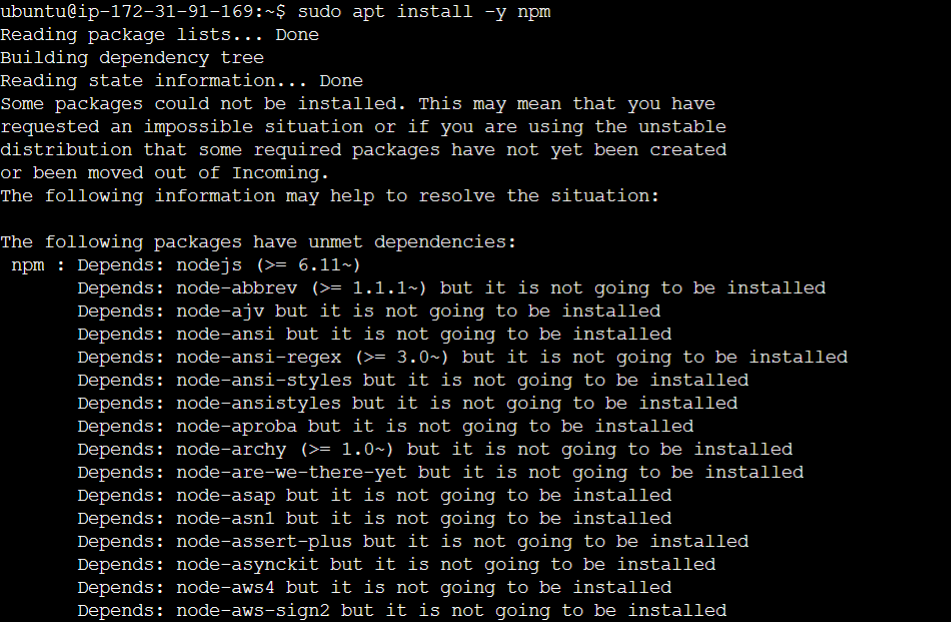

Install body-parser package

We need ‘body-parser’ package to help us process JSON files passed in requests to the server.

sudo npm install body-parser

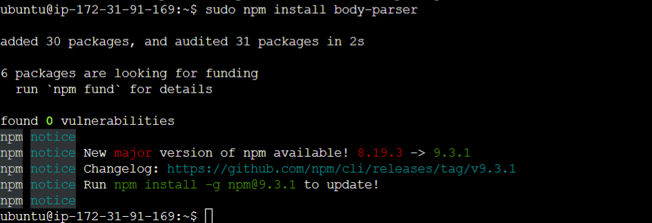

Create a folder named ‘Books’

mkdir Books && cd Books

In the Books directory, Initialize npm project

npm init

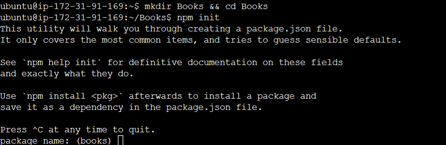

Add a file to it named server.js

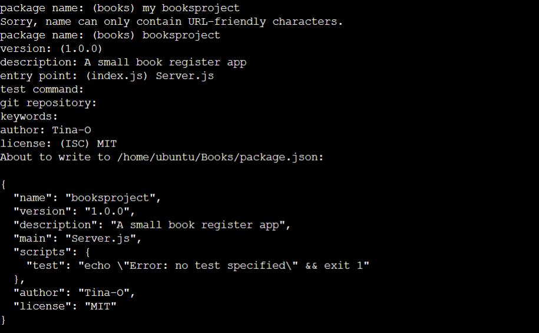

Run vi server.js in Books directory

Copy and paste the web server code below into the server.js file

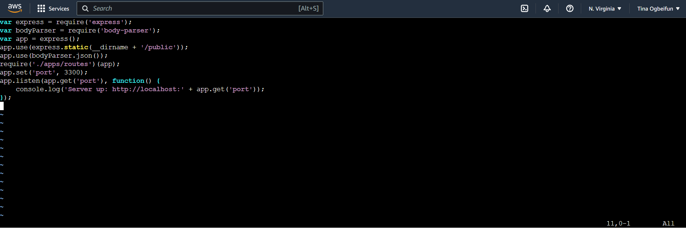
# Install Express and set up routes to the server

Express is a minimal and flexible Node.js web application framework that provides features for web and mobile applications

sudo npm install express mongoose

In ‘Books’ folder, create a folder named apps

mkdir apps && cd apps

Create a file named routes.js

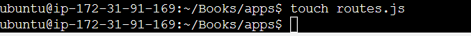

vi routes.js

Copy and paste the code below into routes.js

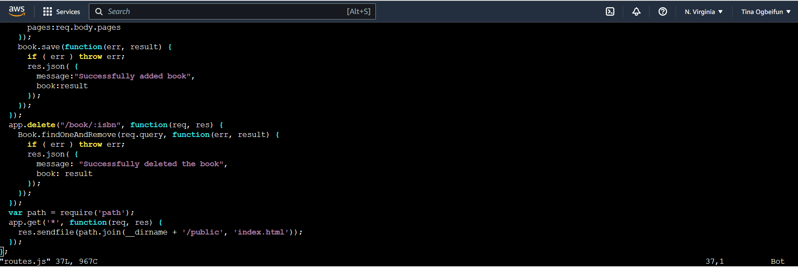

In the ‘apps’ folder, create a folder named models

mkdir models && cd models

Create a file named book.js

vi book.js

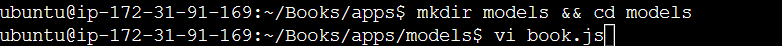

Copy and paste the code below into ‘book.js’

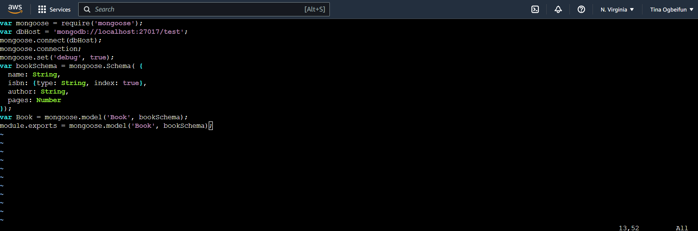

# Access the routes with AngularJS

AngularJS provides a web framework for creating dynamic views in your web applications. In this tutorial, we use AngularJS to connect our web page with Express and perform actions on our book register.

Change the directory back to ‘Books’

cd ../..

Create a folder named public

mkdir public && cd public

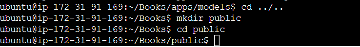

Add a file named script.js

vi script.js
Copy and paste the Code below (controller configuration defined) into the script.js file

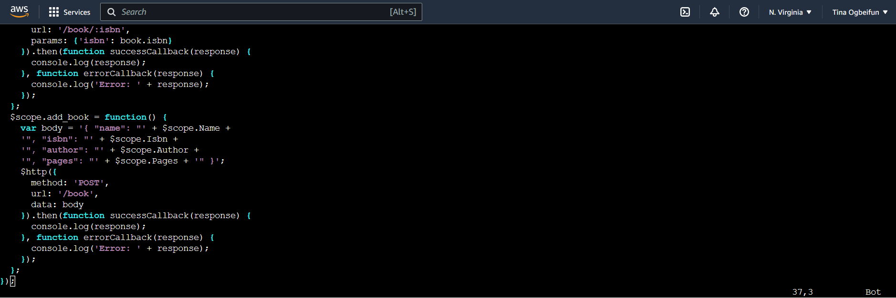

In public folder, create a file named index.html;

vi index.html

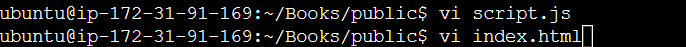

Cpoy and paste the code below into index.html file

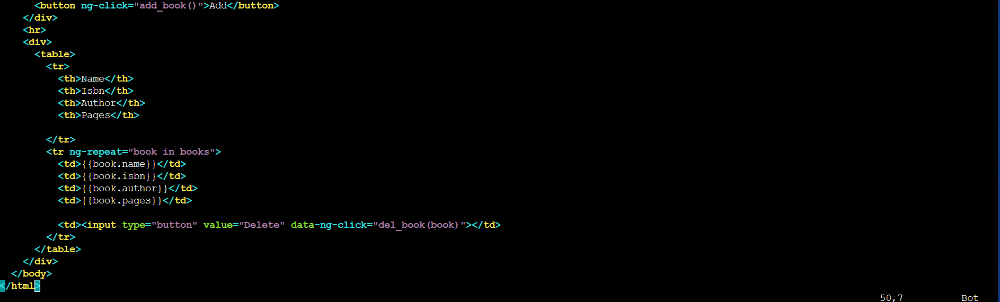

Change the directory back up to Books

cd ..
Start the server by running this command:

node server.js

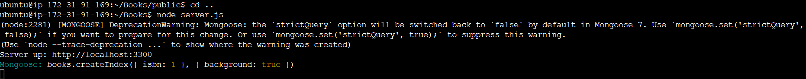

The server is now up and running, we can connect it via port 3300. You can launch a separate Putty or SSH console to test what curl command returns locally.

curl -s http://localhost:3300

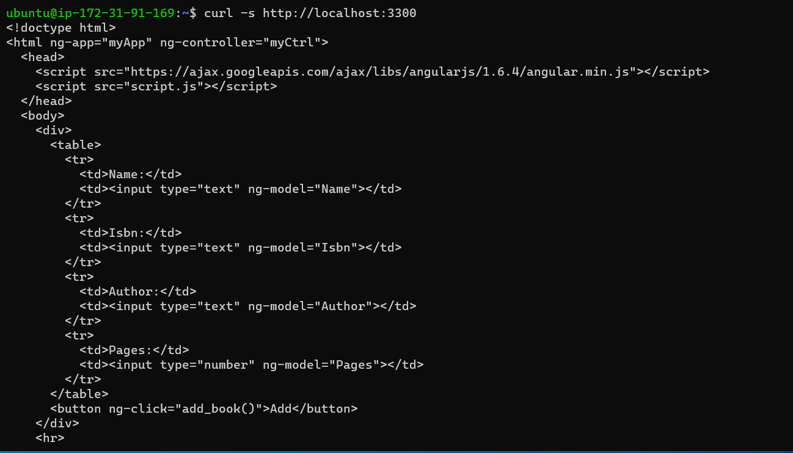

It shall return an HTML page, it is hardly readable in the CLI, but we can also try and access it from the Internet.

For this – you need to open TCP port 3300 in your AWS Web Console for your EC2 Instance

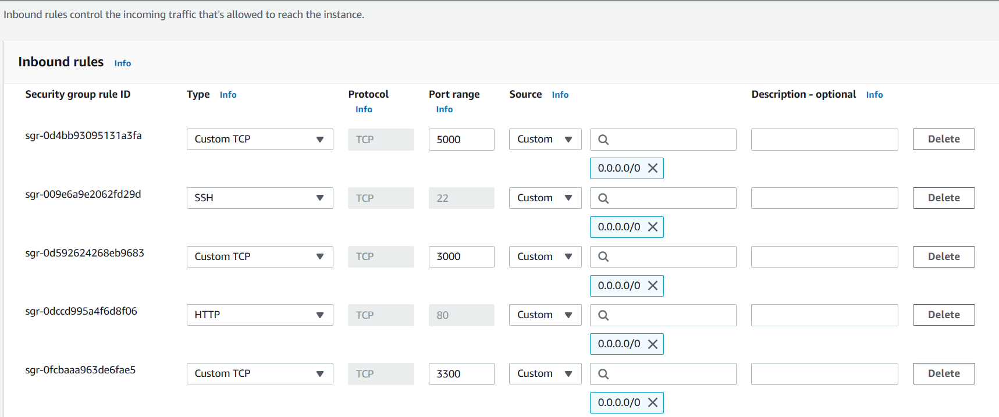

To access our Book Register web application from the Internet with a browser using Public IP address or Public DNS name

Run curl -s http://169.254.169.254/latest/meta-data/public-ipv4 for Public IP address or curl -s http://169.254.169.254/latest/meta-data/public-hostname for Public DNS name.
This is how your Web Book Register Application will look like in browser

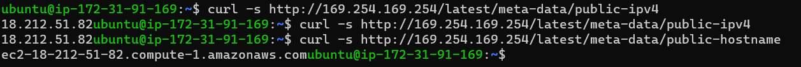

Book Register Application on the internet

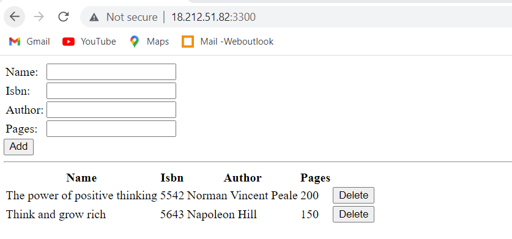

